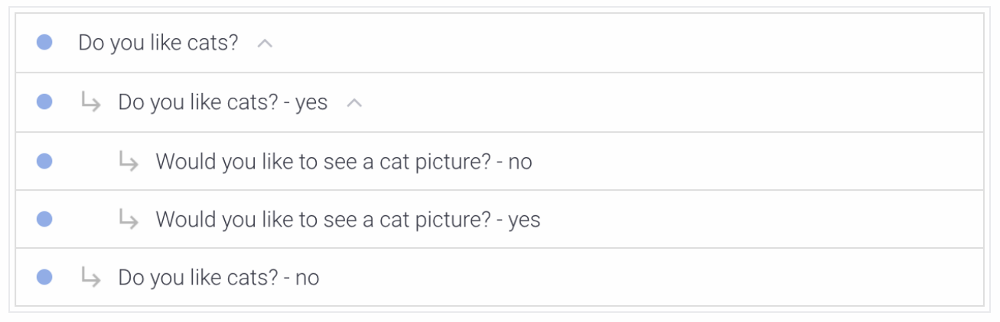
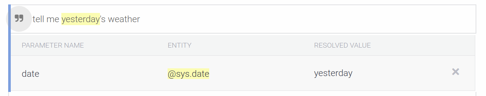

# Google Assistant

Having heavily investigated [Amazon Alexa](http://github.com/mramshaw/Alexa-Stuff), it seemed to be time
to take a good look at __Google Assistant__.

## Content

The contents are as follows:

* [About Google Assistant](#about-google-assistant)
* [Software versus Hardware](#software-versus-hardware)
* [Devices](#devices)
* [So what's it good for?](#so-whats-it-good-for)
* [Installation](#installation)
    * [Android phones](#android-phones)
    * [Entry-level Android devices](#entry-level-android-devices)
    * [iOS Devices](#ios-devices)
* [Voices](#voices)
* [Wake Word](#wake-word)
    * [Smartwatches](#smartwatches)
    * [Smartphones](#smartphones)
* [Cancel](#cancel)
* [Easter Eggs](#easter-eggs)
* [Google Actions](#google-actions)
    * [Actions on Google](#actions-on-google)
    * [Simulator](#simulator)
    * [Languages](#languages)
* [Dialogflow](#dialogflow)
    * [Caveat](#caveat)
    * [Intents](#intents)
    * [Parameters](#parameters)
    * [Entities](#entities)
    * [Fulfillment](#fulfillment)
    * [Integrations](#integrations)
    * [Small Talk](#small-talk)
    * [Code repositories](#code-repositories)
* [SSML](#ssml)
* [Certification](#certification)
* [Privacy](#privacy)
* [Reference](#reference)
    * [Dialogflow Concepts](#dialogflow-concepts)
    * [Google's Conversation design](#googles-conversation-design)
* [To Do](#to-do)

## About Google Assistant

Google Assistant is Google's voice assistant, which grew out of [Google Now](http://en.wikipedia.org/wiki/Google_Now).

Wikipedia has a pretty good article about Google Assistant:

	http://en.wikipedia.org/wiki/Google_Assistant

## Software versus Hardware

__Google Assistant__ is the software part of Google's voice offerings while __Google Home__ devices are
(one of) the hardware components.

## Devices

In addition to Google Home and other Google devices, Google Assistant is available on Android devices
(including [Wear OS](http://wearos.google.com) devices such as smartwatches) and also iOS devices.

## So what's it good for?

An awful lot of things. For one thing, it's pretty much a fully-fledged __VUI__ (voice user interface)
as you can acccess just about every feature on your Android phone with a simple voice command. And with
the upcoming [App Actions](http://developers.google.com/actions/appactions/overview) it will soon be
possible to call into your phone apps (this will require some action on the part of app developers,
however).

## Installation

Google Assistant is available for a variety of different devices, often pre-installed.

#### Android phones

To enable Google Assistant on your Android phone, navigate to the Google Play store and install it:

    http://play.google.com/store/apps/details?id=com.google.android.apps.googleassistant

#### Entry-level Android devices

For entry-level Android phones there is Google Assistant Go:

    http://play.google.com/store/apps/details?id=com.google.android.apps.assistant

[This app should come pre-installed on Android (Go edition) devices.]

There is a nice summary of this app's uses here:

    http://support.google.com/assistant/answer/7556235

#### iOS Devices

To enable Google Assistant on iOS devices, navigate to the App Store and install it:

	http://itunes.apple.com/us/app/the-google-assistant-get-help-anytime-anywhere/id1220976145

[As might be expected, Google Assistant is not integrated as tightly with iOS as Siri is - so there
 are things that Siri can do that Google Assistant cannot, nevertheless the reviews are pretty good.]

## Voices

Internally, Google Assistant has several voices available. These are colour-coded, with names like "Red"
and "Purple". Additionally, there are voices with names that subtly hint at their origins - these have
names like "British Racing Green" and "Sydney Harbour Blue".

As you would expect, the default voice (Red) is actually the best choice - although being able to choose
a personalized custom voice is a very nice touch.

## Cancel

It is possible to stop at any point by saying (or typing) "cancel".

Here in the Actions Simulator we can see this (Android devices will look slightly different but function in the same way):

Likewise, the large "X" (top left) may be tapped or clicked to terminate the app.

In the Actions Simulator, the "cancel" lozenge may be tapped or clicked to terminate the app.

[This lozenge will not be presented on Android devices unless programmed.]

## Wake Word

To let Google know you want to invoke a Google Action, start with:

    "Hey Google"

As in:

    "Hey Google, Talk to Peanut Allergy Facts"

Here __Peanut Allergy Facts__ is the app to be invoked, and __Hey Google__ is what is known as a ___Wake Word___.

Google have taken the concept of a __wake word__ literally, as you can set up your Android phone to wake up
whenever you say the words __Hey Google__ - this requires configuration and is not the default behaviour.

As opposed to Amazon Alexa, which expects verbs such as __Open__, __Launch__ or __Start__, in Google Assistant
the standard way to invoke an app is with __Talk to__ (of course you may still specify Open, Launch or Start
instead).

This breaks down as follows:

Vendor|wake word|verb|app name
------|---------|----|--------
__Amazon__|Alexa,|open|Peanut Allergy Facts
__Google__|Hey Google,|Talk to|Peanut Allergy Facts

This distinction between the normal ___verb___ is probably insignificant, as both vendors allow customization.

[Amazon also allows customization of its [wake word](http://github.com/mramshaw/Alexa-Stuff#wake-word).]

#### Smartwatches

With a [Wear OS](http://wearos.google.com) device, either say "Ok Google" or else press and hold the power button
to get started.

#### Smartphones

If you are using the Google Assistant __app__ on your smartphone, simply press the Google Assistant icon.

There is no need to say either "Hey Google" or "Ok Google" if you are talking to the Google Assistant __app__.

Simply say "start Peanut Allergy Facts" and proceed accordingly.

## Easter Eggs

Google Assistant comes with a nice selection of Easter Eggs.

Say any of the following phrases for an Easter Egg:

	"Testing"
	"Tell me a joke"
	"Tell me a story"
	"Do a barrel roll"
	"What's the loneliest number?"
	"Make me a sandwich"
	"When am I?"
	"Can you pass the turing test?"
	"I am your father"
	"Set phasers to stun"
	"Set phasers to kill"
	"It's my birthday"
	"Do you want to build a snowman?"
	"How many roads must a man walk down?"

[There are other Easter Eggs as well. They are mostly topical, so some of them may be replaced or removed.]

## Google Actions

Individual components for Google Assistant are called ___Actions___.

These are similiar to - but not ___quite___ the same thing - as what AWS Alexa calls ___Skills___. It seems
Google uses a very narrow definition - as in, an action consists of an intent and its matching fullfillment - while
Alexa skills are ___groupings___ of these, usually oriented towards a particular end use. This apparently explains
the gap between the 80,000 or so current Alexa Skills and Google's purported 1,000,000+ Actions.

To see available Google Actions, refer to:

    http://assistant.google.com/explore

Note that certain actions may not be available in all languages or all regions.

It is possible to configure Google Assistant so as to trigger multiple actions with a single voice command.

Google Actions offers `Built-in intents`, `Templates` and `Home automation` - any of which may serve your purposes.

For everything else there are `Custom intents` - which will open a [Dialogflow](#dialogflow) console in a new window.

#### Actions on Google

Internally the various web pages that address Google Actions refer to them as `Actions on Google`.

#### Simulator

Actions on Google has an excellent simulator, which is invaluable for testing.

Be aware that there can be subtle differences between how things look and sound in this simulator and how they
look and sound on an actual device. As always, remember to test on any targetted devices, as this is the real
test of your app.

#### Languages

It is possible to make specific Actions on Google multilingual. While this may be fine for simpler projects,
in my experience it is not a good idea for projects that will use Dialogflow (generally more advanced projects).
While there will be some extra maintenance with having separate projects for each language, it will simplify
testing and has other benefits.

Likewise, unless you are planning on addressing regional language differences (using specific vocabulary and
terms for `American English` versus `British English`, say) then it is another good practice to NOT specify
language locales - this will also simplify testing, but mainly reduces maintenance efforts.

## Dialogflow

While it is possible to create simple actions within the Google Actions console, for more sophisticated
actions there is the aptly-named [Dialogflow](http://dialogflow.com/).

Google originally purchased [API.AI](http://api.ai) which it rebranded as Dialogflow. [API.AI was previously
known as Speaktoit. Note that the API.AI URL redirects to Dialogflow.] Nevertheless, YouTube videos and
the like occasionally still refer to API.AI; any changes are generally minor and cosmetic.

One interesting thing about Dialogflow is that it can interact with multiple backend services, such as
Slack and Alexa (it refers to these as [integrations](#integrations)). It is not limited to Google Actions
although these are obviously the prime target. However, it does require a Google Project for the frontend
portion.

Dialogflow refers to what Alexa calls skills and Google calls apps as ___Agents___.

Dialogflow offers `Prebuilt agents` as well as `Small Talk` - both of which may serve your purposes and are
well worth a look.

Agents are generally coordinated within a Request/Response format, possibly using ___webhooks___.

Inidividual [intents](#intents) must be established - after which optional [entities](#entities) may be
established and [fulfillment](#fulfillment) or [integrations](#integrations) may take place.

#### Caveat

If work is to be carried out in a team setting, be aware that Dialogflow (and Google Actions) offer limited
protection against concurrent access. Random undocumented errors may occur if more than one person is trying
to modify a given resource at any one time.

Dialogflow has good Import/Export functionality and it is probably a ___best practice___ to use this to take
frequent backups - as corruption may easily occur if there is multi-user access.

[This is not often a problem, but may well be serious if it happens. ___Forewarned is forearmed___.]

#### Intents

Broadly speaking these are the main concepts of a question or statement.

[I have diagrammed these for the [Wit.ai API](http://github.com/mramshaw/GCP-Slackbot#wit).]

Intents can be individually tested from within Dialogflow.

Follow-up intents are a special case - these can only match if their parents have previously matched.

Read more about Follow-up intents here:

    http://cloud.google.com/dialogflow/docs/contexts-follow-up-intents

#### Parameters

These seem to be _parameters_ of the __Intent__ question or statement, for instance in the phrase:

    "tell me yesterday's weather"

In this case `yesterday` constitutes an intent parameter of type 'date' that can be defaulted.

#### Entities

These are the concepts to be established in the dialogue, such as `departure date` or `animals`.

In general they are useful for [whitelisting](http://en.wikipedia.org/wiki/White_list) a finite
set of acceptable values. For instance, a finite list of cities (such as "New York, Paris, Tokyo").
For maintaining an _infinite list_ (such as ___any___ city) they do not work well.

For certain specialized uses where they can be precisely defined programmatically (such as __dates__,
for instance) they work exceptionally well.

For more information, refer to the documentation:

    http://cloud.google.com/dialogflow/docs/entities-overview

#### Fulfillment

Generally speaking, these operate as extension points to the existing dialogue flow.

Normally these would operate as external API calls.

> Fulfillment is code that's deployed as a webhook

    http://cloud.google.com/dialogflow/docs/fulfillment-overview

[It may also consist of code that is defined in the Inline Editor. It's either/or,
as in EITHER a webhook OR inline code. The inline code will be __javascript__ and
will be deployed to [Google Firebase](http://firebase.google.com/).]

#### Integrations

Generally speaking, integrations will be to Google Assistant - but many other options are possible.

#### Small Talk

This is where to set up responses to random human utterances, which is generally known
as __Small Talk__. Wikipedia has a pretty good article:

    http://en.wikipedia.org/wiki/Small_talk

Generally it seems to be for social purposes; how appropriate it is for human-computer
interations is still to be established.

Google Assistant has a number of preprogrammed responses but it is possible to create
responses specific to your app here. So basically app-specific [Easter Eggs](#easter-eggs).

Surprisingly, the answer to the most useful question ("tell me about yourself") does
__not__ seem to be available in the "About agent" list to be over-ridden (however the
Google-supplied replies seem to be adequate). Still, it might be nice to be able to
define more specific responses about the particular app being interacted with.

#### Code repositories

Dialogflow maintains a useful set of code repositories:

    http://github.com/dialogflow

## SSML

[SSML](http://en.wikipedia.org/wiki/Speech_Synthesis_Markup_Language) or ___Speech Synthesis Markup Language___
is markup language that was created by the W3C’s Voice Browser working group. It is used in Amazon Alexa
(and probably other voice apps) as well as in Google Assistant.

The version of SSML available for Google Assistant is a _subset_ of the [W3 SSML specification](http://www.w3.org/TR/speech-synthesis/)
but also includes Google-specific SSML extensions, such as __\<par\>__ and __\<seq\>__ (these respectively
allow parallel playback of media clips and sequential playback of media clips).

While SSML is supported, it is __not__ supported in the Dialogflow simulator:

> Note: SSML is supported in the [Actions Simulator](http://developers.google.com/actions/tools/simulator), but not the Dialogflow simulator.

Likewise SSML is not __fully__ supported:

> Note that not all of the elements and options described in the W3 SSML specification are currently supported by the Actions on Google platform.

Both of the above quotes are from the following page:

    http://developers.google.com/actions/reference/ssml

[This page is worth bookmarking.]

## Certification

While Alexa offers _beta testing_, Google Assistant offers _alpha testing_ __and__ _beta testing_.

Unlike Alexa, Google Assistant will increment a version number as each successive Google Action is certified.

Also unlike Alexa, Google __requires__ a published ___privacy policy___ as a part of its certification
process (it is impossible to get an Action certified without one, even if it captures no data of any
kind).

[It seems that certification takes about 4 business days.]

## Privacy

As noted above, Google has taken steps to be transparent as to the type of data it captures.

Read Google's published Privacy Policy:

    http://policies.google.com/privacy

Also, each certified Action has a published privacy policy.

If privacy is a concern, it is possible to view (and manage) the personal information that Google tracks:

    http://myactivity.google.com/

[This is very much worth looking at, if simply to see the type of granular detail that Google tracks.]

The following privacy checkup link is worth a look as well:

    http://myaccount.google.com/intro/privacycheckup

Google appears to be fairly responsible in the way that it always asks for consent to capture personal
data (such as voice snippets, or gesture usage, etc). While Google Apps generally require opting-in to
this type of data capture (if only for voice recognition or gesture recognition purposes), permission
can always be revoked at a later stage (and the captured data can also be deleted).

## Reference

One or two useful references are listed below.

#### Dialogflow Concepts

A good place to start is by reading up on Dialogflow Concepts:

    http://cloud.google.com/dialogflow/docs/concepts

#### Google's Conversation design

Some very useful content that is well worth a read:

    http://designguidelines.withgoogle.com/conversation/

[These guides seem to include a lot of information that doesn't appear anywhere else.]

> Google Design is a cooperative effort led by a group of designers, writers, and developers at Google.
> We work across teams to publish original content, produce events, and foster creative and educational
> partnerships that advance design and technology.

From: http://design.google/resources/

## To Do

- [ ] Continue testing
- [ ] Investigate Firebase integration
- [ ] Write some webhooks to investigate fulfillment
- [x] Add notes on what Google Assistant is useful for
- [x] Add practical considerations for working in a team environment
- [x] Add comprehensive installation notes
- [x] Add a selection of Easter Eggs
- [x] Add a Reference section
- [x] Investigate Dialogflow
- [x] Investigate Dialogflow and SSML
- [ ] Investigate Dialogflow fulfillment
- [ ] Investigate Dialogflow integrations (other than Google Actions)
- [x] Investigate Dialogflow Small Talk
- [ ] Investigate Google Assistant versus Alexa versus Siri
- [ ] Investigate Google Stackdriver logging
- [x] Update links for the migration of Dialogflow documentation to Google docs
- [ ] Publish a Google Action
